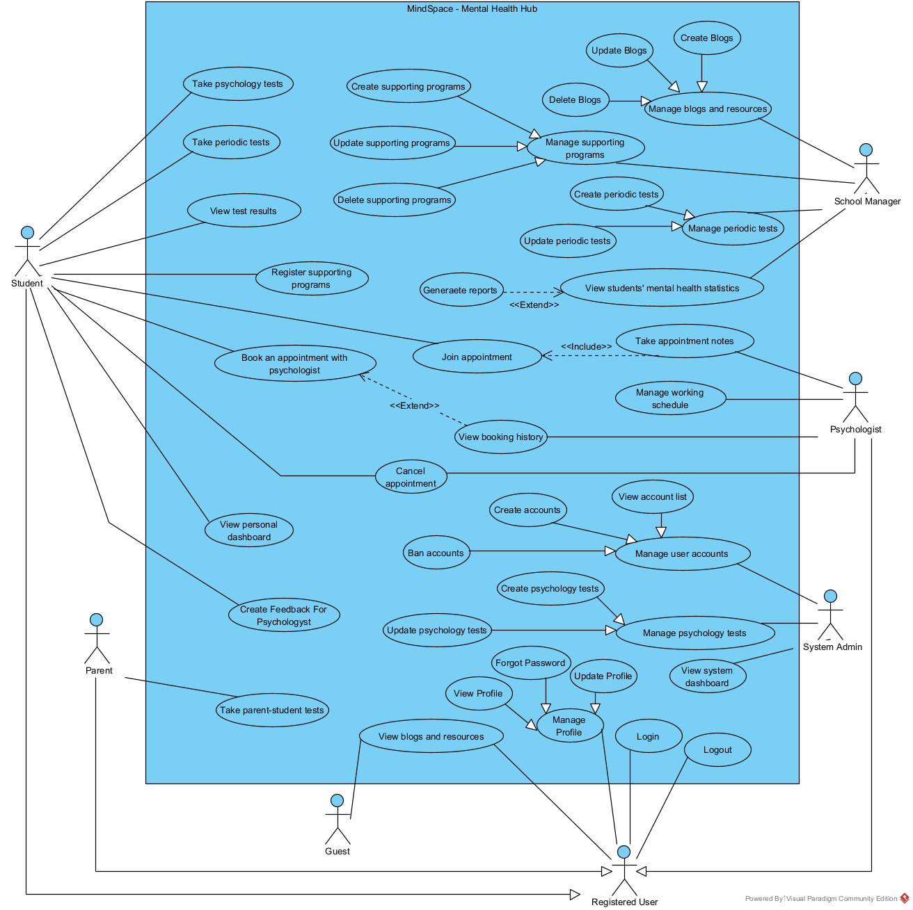
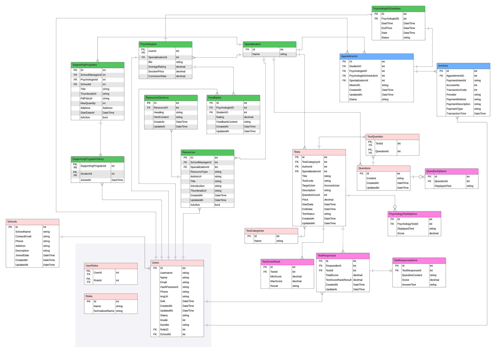
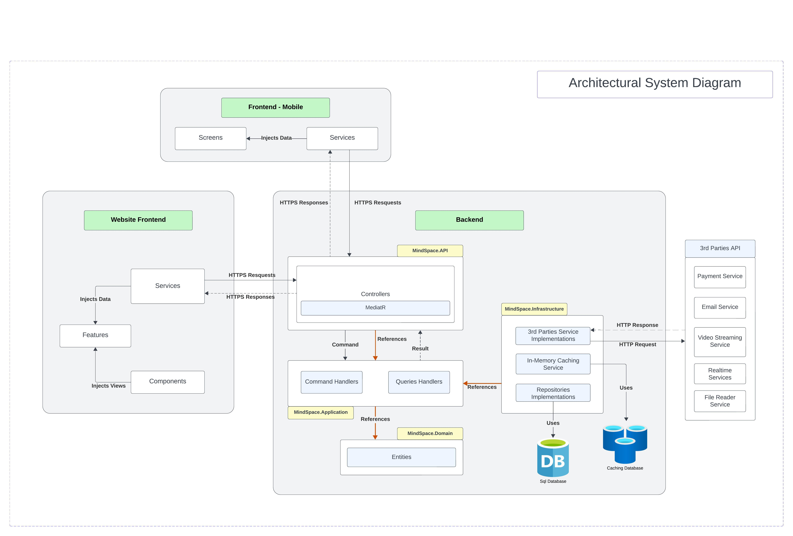
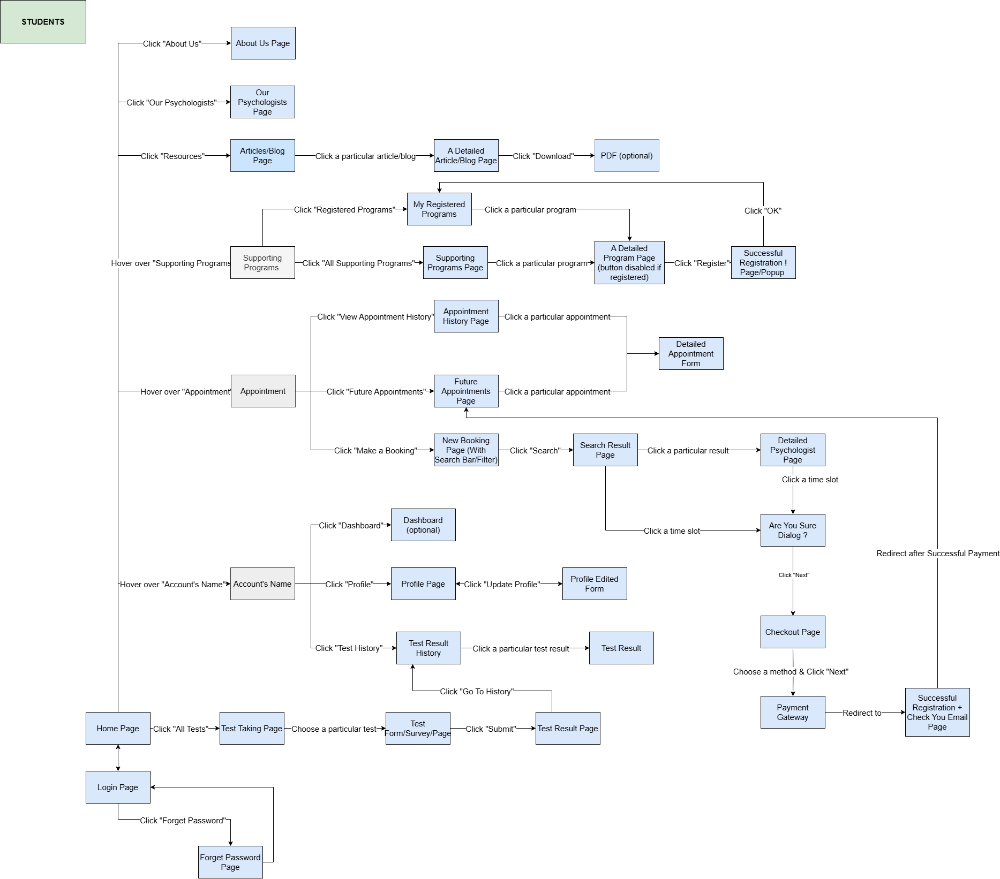
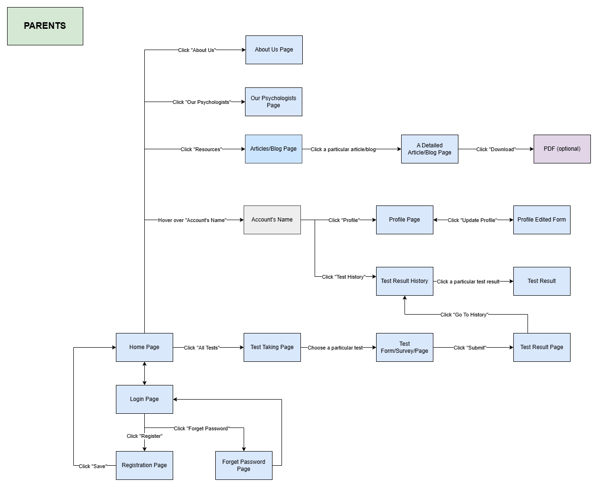
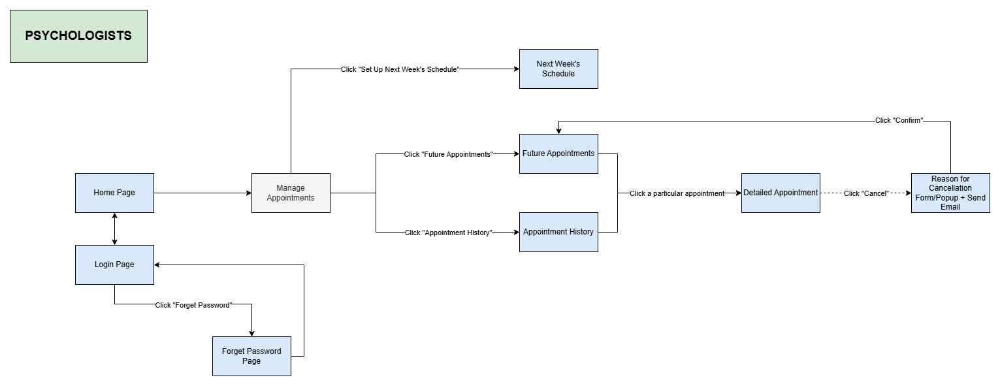
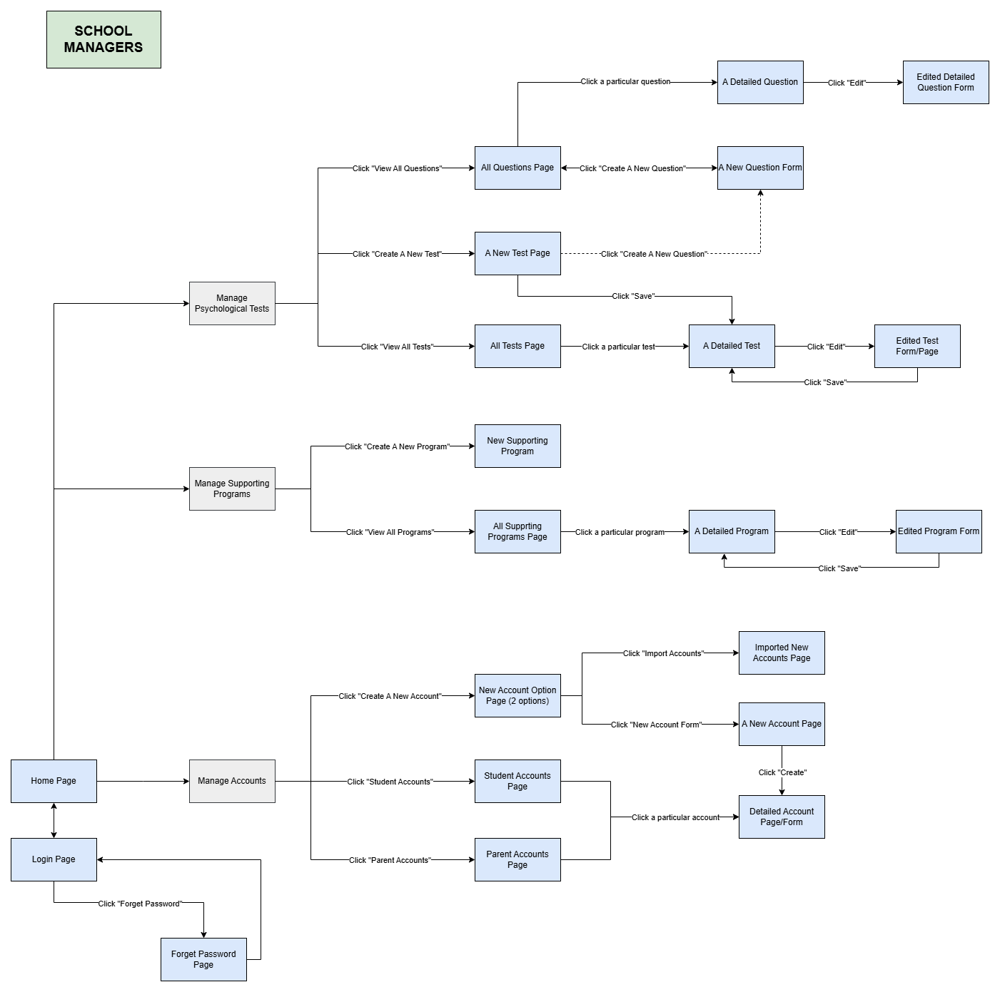
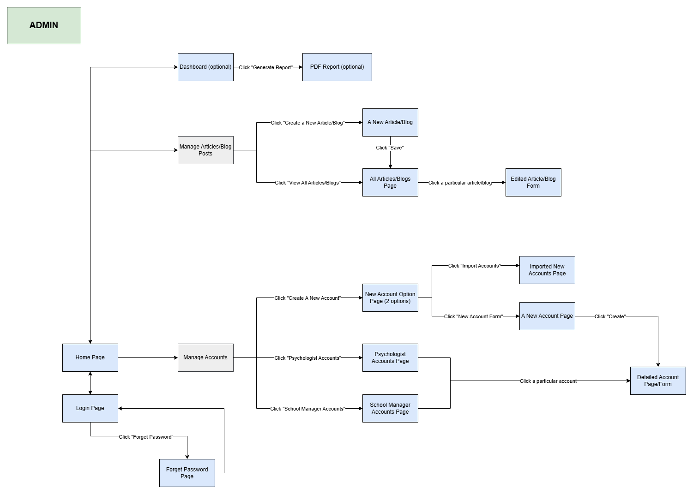

# MindSpace - School Mental Health Management System

    
    
MindSpace is a web application that provides mental health services for high school students and parents.

 
 
 
 
 

 

## Table of Contents
<ol start="0"> 
    <li><a href="#intro">Introduction</a></li>
    <li><a href="#tech">Tech Stacks</a></li>
    <li><a href="#uc-diagram">Use Case Diagram</a></li>
    <li><a href="#uc-diagram">Architecture Diagram</a></li>
    <li><a href="#db-design">Database Design</a></li>
    <li><a href="#screen-flow"> Screen Flow</a></li>
    <li><a href="#team-members">Team Members</a></li>
    <li>
        <a href="#app-a">Appendix A</a>
    </li>
</ol>

## 0. Introduction
The increasing concern for students' mental health in Vietnamese schools highlights the need for a structured psychological support system. 
Currently, many schools lack a standardized approach to managing students' well-being. 
MindSpace aims to bridge this gap by providing a digital platform where students can access professional counseling services, schools can monitor overall student mental health trends, and psychologists can offer their expertise.

## Core Features

- **Psychological Assessments**: Students can take structured psychological tests to evaluate their mental health.
- **Supporting Programs**: Schools provide students with three free Supporting Programs through workshops and webinars for specific targets (e.g., school mental health, anxiety, etc.), featuring professional psychologists.
- **Appointment Scheduling**: Students can book sessions with licensed psychologists directly through the platform.
- **Confidential Chat System**: Secure messaging between students and an AI chatbot for follow-up support.
- **Mental Health Resources**: A curated library of self-help materials, articles, and exercises for students.
- **Administrative Dashboard for Schools**: Schools can monitor student participation and access general mental health trends (without violating privacy).
- **Psychologist Management System**: Tools for psychologists to manage their schedules, session notes, and earnings.

## Target Users

- **Primary Users**:
  - School managers
  - Students
  - Psychologists
- **Secondary Users**:
  - Parents
    

## 1. Tech Stacks

### Client & Server  
The **Client** stack includes front-end technologies for building web and mobile applications, while the **Server** stack consists of backend frameworks, authentication, logging, and design patterns.  

| Client | Description | Server | Description |
|--------|------------|--------|------------|
| TypeScript  | Strongly typed JavaScript | ASP.NET Core Web API  | Backend framework for building APIs |
| Next.js  | React framework with server-side rendering | .NET Entity Framework  | ORM for database interactions |
| React Native  | Mobile app development | ASP.NET Identity  | Authentication and authorization |
| Hero UI  | UI component library | Serilog  | Structured logging framework |
| Tailwind CSS  | Utility-first CSS framework | Quartz.NET  | Job scheduling library |
| Axios  | HTTP client for API requests | JWT Authentication  | Token-based authentication |
| | | Postman  | API testing tool |
| | | Swagger OpenAPI  | API documentation generator |
| | | SignalR  | Real-time communication |
| | | Mediator Pattern  | Decouples communication between components |
| | | CQRS with Clean Architecture  | Separates read/write operations |

---

### Database & API Deployment  
The **Database** stack includes data storage solutions, while **API Deployment** contains tools for containerization, automation, and cloud services.  

| Database | Description | API Deployment | Description |
|----------|------------|---------------|------------|
| Microsoft Azure SQL Server  | Cloud-based relational database | Docker  | Containerization platform |
| Redis  | In-memory caching database | GitHub Actions  | CI/CD automation |
| | | Azure Cloud Services  | Backend deployment |
| | | ngrok  | Local development tunneling |

---

### Others  
Additional services and third-party APIs that enhance functionality, such as AI, payments, video streaming, and file storage.  

| Service | Description |
|---------|------------|
| Gemini API  | AI-powered chatbot service |
| Stripe API  | Online payment processing |
| WebRTC  | Peer-to-peer video streaming |
| Cloudinary  | Image and video storage |

## 2. Use Case Diagram

## 3. Database Design

## 4. Architecture Diagram

## 5. Screen Flow

### 5.1. Student Screen Flow:

### 5.2. Parent Screen Flow:

### 5.3. Psychologist Screen Flow:

### 5.4. School Manager Screen Flow:

### 5.5. Admin Screen Flow:

## 6. Team members
- [Vu Kim Duy](https://github.com/AnonyFriday): Project Leader, Web Front-End, Back-End Developer
- [Phan Tuan Dat](https://github.com/imbatcat): Web Front-end, Back-End Developer
- [Vo Thi Mai Hoa](https://github.com/vohoa2004): Web Front-End, Back-End Developer
- [Nguyen Thi Bich Duyen](https://github.com/cuckoo01): Web Front-End Developer
- [Tran Van Tien Dat](https://github.com/datTOK): Web Front-End Developer
- [Le Minh Quan](https://github.com/QuanLM270302): Mobile Front-End Developer

# Appendix A
